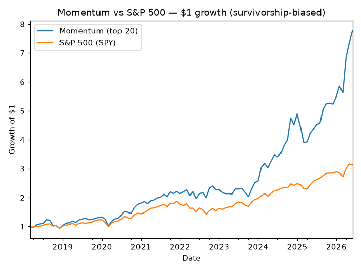

# Backtest: does a momentum edge exist?

The project was built to answer one question honestly: **is there a real factor
edge, or is this just a well-organized second opinion?** `backtest.py` runs the
test the *right* way — and the result is a case study in not fooling yourself.

## The test

- **Strategy:** each month, rank the universe by trailing 12-month price momentum
  (skipping the most recent month — standard 12-1 momentum), hold the top 20
  equal-weight, rebalance monthly, charge 10 bps per trade on turnover.
- **Why only momentum:** daily prices are *point-in-time*, so ranking by past
  returns uses no future information — a clean test. The fundamental verdict is
  **not** point-in-time (yfinance serves today's P/E, ROE, etc.), so backtesting
  it would be lookahead cheating. The engine refuses to.
- **Benchmark:** buy-and-hold SPY. Period: 2018–2026 (~100 months).

## The result

| | Momentum (top 20) | S&P 500 |
|---|---|---|
| Total return | **+678%** | +213% |
| Annualized | **+27.9%** | +14.7% |
| Volatility | 24.2% | 16.5% |
| Sharpe | 1.14 | 0.92 |
| Max drawdown | −24.0% | −23.9% |

Momentum "beat" the market by **+13.2%/year.**

## Why you should NOT believe it

A result this good is a **red flag, not a discovery.** It is inflated by
**survivorship bias**:

- The universe is **today's** S&P 500 — the *survivors*. Companies that went
  bankrupt or were delisted are absent from the data entirely.
- So the backtest ranks momentum among names that already turned out to be
  winners. The momentum stocks that later collapsed never appear.
- If a +13%/yr edge were really this easy to capture, every fund would harvest
  it and it would disappear. The backtest claiming it's easy is evidence the
  backtest is wrong.

What *is* mildly credible: the Sharpe improvement (1.14 vs 0.92) is harder to
fake than raw return, and momentum has genuine academic support — but the
headline outperformance is survivorship noise, not a tradeable strategy.

## What an honest test would require

**Point-in-time index membership** — the actual S&P 500 constituents as they
stood each month, including the names that later died. That is paid data (CRSP,
Norgate). The honest takeaway isn't "I found a 13%/yr edge." It's:

> **Markets are roughly efficient, easy edges are illusions, and the most
> important skill is recognizing when your own backtest is lying to you.**

*Not investment advice.*
